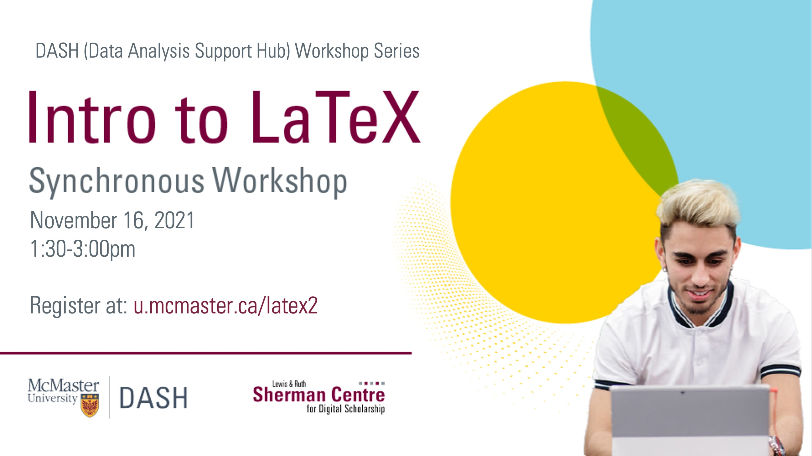

# Introduction to Document Typesetting and Scientific Publishing with LaTeX

This module will introduce you to LaTeX, a typesetting system commonly used in STEM disciplines to create high-quality documents and easily write mathematical equations. 

In this tutorial, we will discuss tools for writing in LaTeX, the structural elements of LaTeX, text formatting, and commands for writing mathematical equations. You will also learn the commands to create your first LaTeX document.

Presentation by John Fink, Digital Scholarship Librarian.  
[Book an appointment with John or another member of the SCDS Team.](https://libcal.mcmaster.ca/appointments/)

## Prerequisites
<!-- If creating or installing is covered in the module (preparation), mention that in brackets. -->
- An [Overleaf](https://www.overleaf.com/) account.

<!-- What will the student learn to do, learn to use, etc. -->
## Learning Objectives
By the end of this workshop, you will be able to:
- Create simple LaTeX documents
- Use images, equations, and other special content inside your document

<!-- Estimate the time the workshop will take to complete. Feel free to remove this. -->
## Duration
This module will take around 1-2 hours, however feel free to work at your own pace!

## Land Acknowledgement
We'd like to acknowledge that McMaster University sits on the Territories of the Mississauga and Haudenosaunee Nations, and within the lands protected by the Dish With One Spoon wampum agreement.