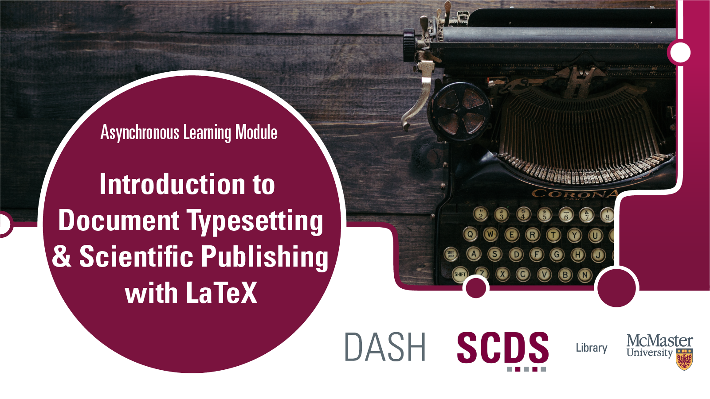

# Introduction to Document Typesetting and Scientific Publishing with LaTeX

This module will introduce you to LaTeX, a typesetting system commonly used in STEM disciplines to create high-quality documents and easily write mathematical equations. 

In this tutorial, we will discuss tools for writing in LaTeX, the structural elements of LaTeX, text formatting, and commands for writing mathematical equations. You will also learn the commands to create your first LaTeX document.

Presentation by John Fink, Digital Scholarship Librarian.  
[Book an appointment with John or another member of the SCDS Team.](https://libcal.mcmaster.ca/appointments/)

## Prerequisites
<!-- If creating or installing is covered in the module (preparation), mention that in brackets. -->
- An [Overleaf](https://www.overleaf.com/) account.

<!-- What will the student learn to do, learn to use, etc. -->
## Learning Objectives
By the end of this workshop, you will be able to:
- Create simple LaTeX documents
- Use images, equations, and other special content inside your document

<!-- Estimate the time the workshop will take to complete. Feel free to remove this. -->
## Duration
This module will take around 1-2 hours, however feel free to work at your own pace!

## Land Acknowledgement
McMaster University is situated in Ohròn:wakon which is the traditional territories of the Erie, Neutral, Huron-Wendat, Haudenosaunee and Mississaugas. This land is covered by the “Dish With One Spoon Wampum Belt Covenant”, an agreement between the Haudenosaunee confederacy and Anishinaabe nations to ensure those who live here take only what they need, leave enough in the dish for others, and keep the dish clean. This land is also covered by the Between the Lakes Treaty of 1792 and is very close to the 1784 Haldimand Treaty, which holds the land six miles to each side of the Grand River as a tract for Six Nations, which is currently not being honored. 

Many of us at the Sherman Centre took the First Nations' Information Governance Centre's OCAP course this past year which stands for Ownership, Control, Access, and Possession. We encourage you to learn [more about OCAP](https://fnigc.ca/ocap-training/take-the-course/) and Indigenous data management practices more broadly, including the [OCAS principles](https://u.mcmaster.ca/ocas-framework) endorsed by the Manitoba Métis Federation, the principles of [Inuit Qaujimajatuqangit](https://doi.org/10.1139/as-2020-0015), ᐃᓄᐃᑦ ᑕᐱᕇᑦ ᑲᓇᑕᒥ (Inuit Tapiriit Kanatami) [National Inuit Strategy on Research](https://www.itk.ca/national-strategy-on-research-launched/), and Global Indigenous Data Alliance’s [CARE principles](https://www.gida-global.org/care). 
