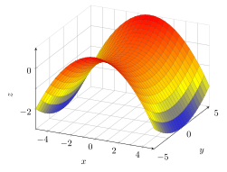
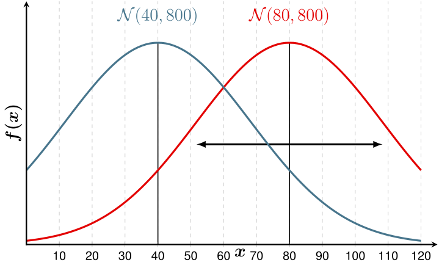

<!-- Allows LaTeX-like Math -->

# Workshop Introduction

<!-- Follow along with the introductory video, slides, or text below.

<iframe height="416" width="100%" allowfullscreen frameborder=0 src="https://echo360.ca/media/eda1d592-eb4e-453d-bd23-0e1a84800ee0/public?autoplay=false&automute=false"></iframe>
[View original here.](https://echo360.ca/media/eda1d592-eb4e-453d-bd23-0e1a84800ee0/public) -->

## What is LaTeX?

 

LaTeX is a markup language for creating high-quality documents. As a markup language, LaTeX takes care of the document formatting so that you can focus on the ontent. Unlike Microsoft Word and Google Docs, you don't need to worry about the formatting of content after the initial setup.

LaTeX is also a very popular tool used to typeset mathematics and other special symbols.

## What Can You Create With LaTeX?

LaTeX is used to make a variety of different types of documents, some of which include:
- Articles
- Book Chapters
- Theses and Dissertations
- Presentations
- Posters
- Assignments and Problem Sets
- Resumes and CVs

## Examples of Math Typesetting in LaTeX    

Using LaTeX for mathematics is a lot quicker than other means of writing. It automatically takes care of the sizing of symbols and the spacing between characters. Below are a couple examples of equations, written both independently of text and in-line with text.

$$ax^2 + bx + c = 0$$

$$ \sum_{n=1}^{\infty} \frac{1}{n} = 1 + \frac{1}{2} + \frac{1}{3} + \frac{1}{4} + \ldots $$

$$ f(x) = \int_{a}^{b}K(x,t)\phi(t)dt $$

The universal law of gravitation can be expressed with the equation $ F = \frac{Gm_{1}m_{2}}{r^{2}} $.

## Examples of Figures created with LaTeX and tikz

  
  (a) Source: [Wikipedia](https://en.wikipedia.org/w/index.php?title=PGF/TikZ&oldid=1157623668)

  
  (b) Source: [Wikipedia](https://en.wikipedia.org/w/index.php?title=PGF/TikZ&oldid=1157623668)

## Examples of Documents created with LaTeX

Tverberg’s theorem is 50 years old: a survey

<embed height="800" width="100%" src="https://arxiv.org/pdf/1712.06119.pdf">
[See original](https://arxiv.org/pdf/1712.06119.pdf)

Practice Exam

<embed height="800" width="100%" src="assets/docs/ExampleDocument2.pdf">
[See original](assets/docs/ExampleDocument2.pdf)

## Tools for writing in LaTeX

### Editors
While you can write LaTeX in just about any text editor, [Texmaker](https://www.xm1math.net/texmaker/) is one of the most popular editors that supports all major operating systems. It comes with built-in tools that make writing in LaTeX a lot easier. 

### Distributions / Compilers
In order to turn your LaTeX code into a document, you need a LaTeX compiler. There are three main compilers for LaTeX, one for each operating system.

Windows
: [MiKTeX](https://miktex.org/)

Mac
: [MacTeX](https://www.tug.org/mactex/)

Linux
: [TeXLive](https://www.tug.org/texlive/)

### Online Editor
An alternative to having a local editor and compiler is to use an online editor, with [Overleaf](https://www.overleaf.com/) being the best out there. It requires no installation to use, it comes with lots of templates and examples, and since your documents are tied to your account, you can access them anywhere.