{: .no_toc}
# Lesson 1 - Creating your first LaTeX document

Description

<details markdown="block">
  <summary>
    Table of Contents
  </summary>
  {: .text-delta }
- TOC
{:toc}
</details>

## Lesson Objectives

- Understand what a document preamble and document body are. 
- Create sections, subsections, paragraphs, and table of contents.
- Use text emphasis to bold, italicize, and underline words.
- Create inline math expressions. 

<!-- ## Lesson Video

The following video demonstrates each of the steps outlined below in text.
<iframe height="416" width="100%" allowfullscreen frameborder=0 src="https://echo360.ca/media/a347ed63-745d-4d08-8b9a-98b2dd0d0e14/public?autoplay=false&automute=false"></iframe>
[View original here.](https://echo360.ca/media/a347ed63-745d-4d08-8b9a-98b2dd0d0e14/public) -->

## Creating a new project in Overleaf

If you haven't already, go to [Overleaf](https://www.overleaf.com/) and log in.

After logging onto Overleaf, you should see your profile dashboard. This page will show you all your projects, as well as giving you the option to create a new project. 

- To create a new project, click on the green `New Project`. You'll see a variety of templates available, but for now we just want the `Blank Project`.

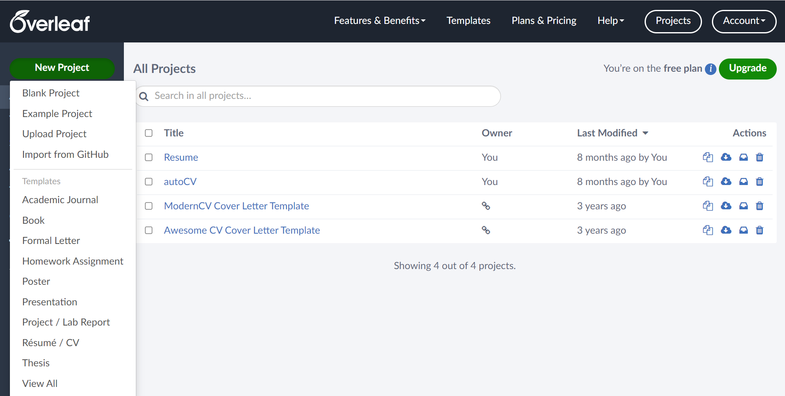

- Give your new project a name. It can be whatever you'd like, but we'll name ours `LaTeX Workshop Document`. When you're done, click on the green `Create` button.

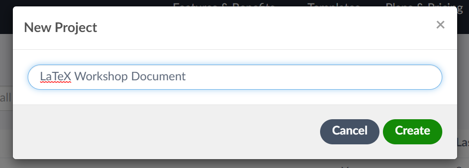

- You should soon see your new document. On the left hand side, you'll see a file explorer and file outline. The file explorer will be used to store any images or extra files we might need to create our document. The file outline will automatically generate something similar to a table of contents, allowing us to move through the document with ease.
- To the right of that, we'll the code editor. This is where we will actually write our LaTeX code.
- Finally, on the right hand side is the document preview. This is where we can see how our LaTeX document looks like.

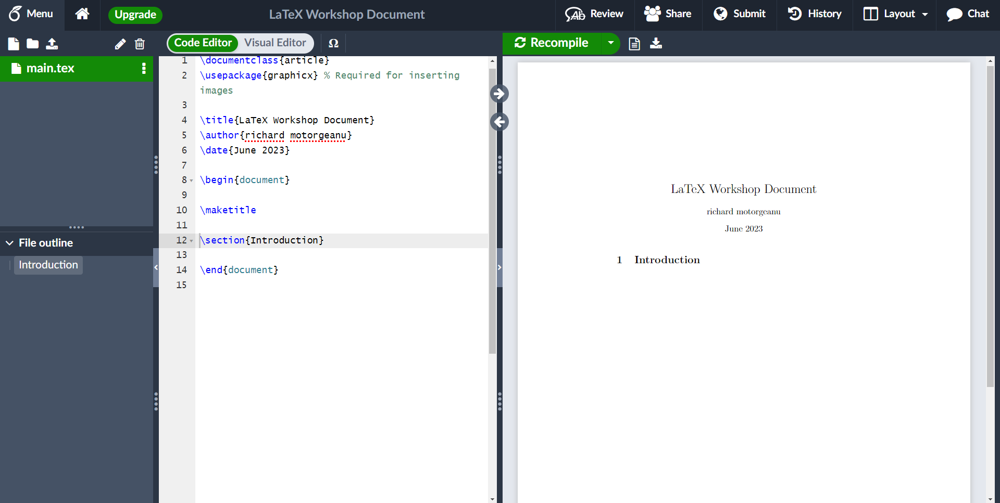

- Above the preview window, there's a green `Recompile` button with a dropdown menu. Every time we make a change to our LaTeX document, the preview window does not update until we recompile our LaTeX code. In the dropdown menu, there's an option for autocompilation, which will make it so that our LaTeX code will recompile automatically whenever we make a change.
  - For the workshop, we recommend leaving autocompilation off. By manually compiling your document, it'll be easier to see the differences in our document before and after a change. When working on documents outside the workshop however, autocompilation is a really powerful tool that helps speed up the process of creating documents.

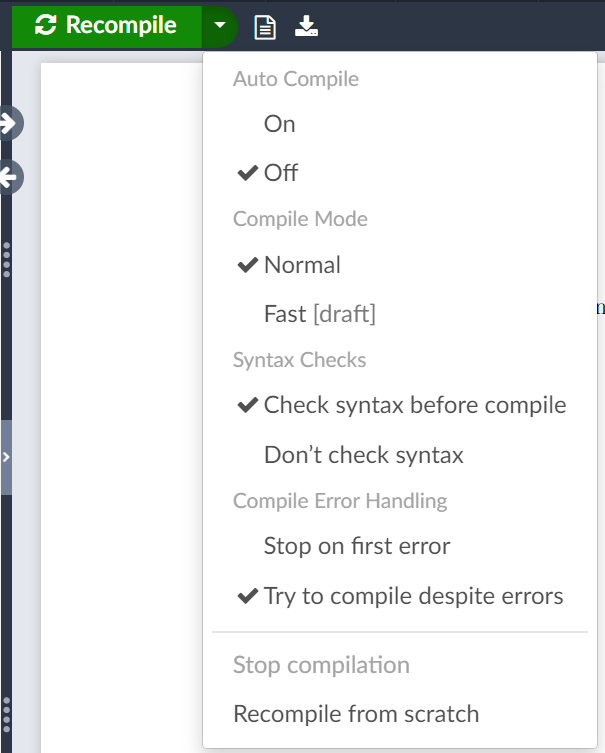

## "Blank" Project Overleaf Template

Despite picking the `Blank Project` option, there's some LaTeX already created! Let's take a few moments to analyse this code before we create our own.

```latex
\documentclass{article}
\usepackage{graphicx} % Required for inserting images

\title{LaTeX Workshop Document}
\author{richard motorgeanu}
\date{June 2023}

\begin{document}

\maketitle

\section{Introduction}

\end{document}
```

### The Preamble
The preamble is any lines of code that comes before the `\begin{document}` line. It consists of the initial LaTeX document setup, telling LaTeX what type of document it's going to be creating, any packages it might need, and some more general information about the document.

#### documentclass

The `\documentclass{article}` line specifies the type of document we're creating. Selecting a different document class will change some of the default formatting options that LaTeX uses, such as the font, font size, spacing, and so forth. There are many document classes available, including:
- report
- book
- slides
- letter
- and a lot more!

For a comprehensive list of document classes, see <https://ctan.org/topic/class>. 

{: .warning}
Take note that, while Overleaf supports most of the document classes listed in the resource provided, you might encounter errors without additional setup. If you installed LaTeX locally, you will likely encounter errors without some extra installations/setup.

#### usepackage

The `\usepackage{graphicx}` line adds in the graphicx package, which lets LaTeX support images. 

With LaTeX, you will be using plenty of packages to add extra functionality to LaTeX. There are currently over 4,000 packages to choose from. They can range from very broad additions to some very specific additions ([like a font for adding images of dice](https://ctan.org/pkg/dice)).

A full list of of packages can be found at <https://ctan.org/pkg>.

Do not worry, you do not have to know what every package does or memorize the names of them. Most documents will only ever use the same 3 or 4 packages.

#### General Information

Lastly, the author, title of document, and date is also specified in our preamble. This information is used later on when creating the title of your document.

### The Document Body
Anything in between `\begin{document}` and `\end{document}` is our document body. This is where we create the content of our document.

There's two lines in the document body of the generated code, `\maketitle` and `\section{Introduction}`.

#### maketitle
`\maketitle` creates the title of your document, using the information from `\title`, `\author`, and `\date`.

#### section
`\section` creates a header for your content. There's also `\subsection`, which creates a subheader to further seperate content. We'll be working with both of these later on.

## Commands and Comments

We'll also briefly touch up on LaTeX commands and comments before starting to edit our LaTeX document.

### Commands
You may have noticed that all special commands start with a \, and that some have additional information inside a pair of curly brackets { }. That additional information is often called a parameter, and there are two types: optional parameters and mandatory parameters (which we'll just call parameters from now on). 

Parameters use curly brackets { } and are required by the command for it to work. All the commands that we've worked with so far have used parameters rather than optional parameters, commands like `\author{}`, `\documentclass{}`, etc.

Optional parameters on the other hand use square brackets [], and they provide some information to the command that's not required for them to function. This is most used to override default settings that the command is using. `\documentclass` accepts some optional parameters to override the default formatting styles that a document class might come with. For example, we can change the font size of an article document to 12pt by changing the `\documentclass{article}` to `\documentclass[12pt]{article}`.

### Comments
Another important thing to mention is the text following the `\usepackage{graphicx}` line. It starts with a %, and the color of the text is slightly faded out compared to the rest of the code. These are comments, and they're used to create notes in code. These notes are ignored by LaTeX, but they're often beneficial for you or others to read.

Since comments are ignored, they're also useful to temporarily disable lines of code! This is great for debugging issues, or testing how the document changes with/without a particular line.

## Your First LaTeX Document

Now that we understand what our LaTeX document is doing, we can start editing and creating our document.

### Changing the Author and Date

- Let's start by editing the author and date for our document. 

{: .note-title }
> Tip
>
> You can use `\today` for the date, and LaTeX will automatically insert today's date. 
>
> ```latex
> \date{\today}
> ```

<details markdown="1">
<summary>Changing Author/Date Example</summary>

{: .label }
Input
```latex
\documentclass{article}
\usepackage{graphicx} % Required for inserting images

\title{LaTeX Workshop Document}
\author{Richie Motorgeanu}
\date{\today}

\begin{document}

\maketitle

\section{Introduction}

\end{document}
```

{: .label .label-green }
Output
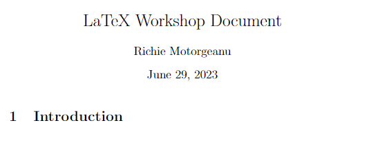

</details>

- If you recompile the document now, you should see that the information in the title has changed.

### Creating New Sections

- Now, let's also try to create new sections and subsections. Use the `\section{}` and `\subsection{}` to create new sections in the document.

<details markdown="1">
<summary>Creating Sections Example</summary>

{: .label }
Input
```latex
% extra lines of code not shown to save space

\begin{document}

\maketitle

\section{Introduction}
\subsection{What is LaTeX?}
\section{Preparation}

\end{document}
```

{: .label .label-green }
Output
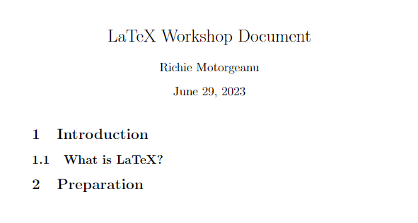

</details>

- You'll notice that the numbering of the sections and the font size of the different headers are automatically handled for you.

### Creating a Paragraph

- To create a paragraph, you simply write the text as you would normally. No fancy commands needed.

<details markdown="1">
<summary>Creating a Paragraph Example</summary>

{: .label }
Input
```latex
% extra lines of code not shown

\section{Introduction}
\subsection{What is LaTeX?}

LaTeX is a markup language for creating high-quality documents. As a markup language, LaTeX takes care of the document formatting so that you can focus on content. Unlike Microsoft Word and Google Docs, you don’t need to worry about the formatting of content after the initial setup.
% this is a comment, so it will not show up in the document

\section{Preparation}

\end{document}
```

{: .label .label-green }
Output
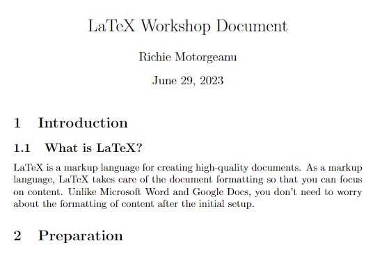

</details>

### Creating New Paragraphs

- Creating new paragraphs is a bit less intuitive. To create a new paragraph after an existing paragraph, you need a blank line in between. See the two examples below, the incorrect way and the correct way, to see how to create a new paragraph.

<details markdown="1">
<summary>Incorrect Way to Create a New Paragraph</summary>

{: .label }
Input
```latex
% extra lines of code not shown

\section{Introduction}
\subsection{What is LaTeX?}

% notice the lack of an empty line between these two paragraphs
LaTeX is a markup language for creating high-quality documents. As a markup language, LaTeX takes care of the document formatting so that you can focus on content. Unlike Microsoft Word and Google Docs, you don’t need to worry about the formatting of content after the initial setup.
LaTeX is also a very popular tool used to typeset mathematics and other special symbols.

\section{Preparation}

\end{document}
```

{: .label .label-green }
Output
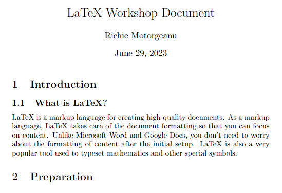

</details>

<details markdown="1">
<summary>Correct Way to Create a New Paragraph</summary>

{: .label }
Input
```latex
% extra lines of code not shown

\section{Introduction}
\subsection{What is LaTeX?}

% take note of the empty line between these two paragraphs
LaTeX is a markup language for creating high-quality documents. As a markup language, LaTeX takes care of the document formatting so that you can focus on content. Unlike Microsoft Word and Google Docs, you don’t need to worry about the formatting of content after the initial setup.

LaTeX is also a very popular tool used to typeset mathematics and other special symbols.

\section{Preparation}

\end{document}
```

{: .label .label-green }
Output
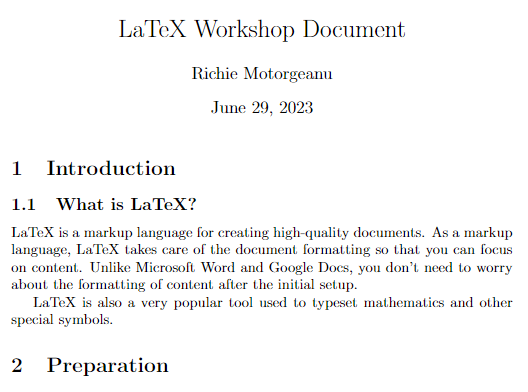

</details>

### Creating a Table of Contents

- LaTeX can also automatically create table of contents for you based on the sections and subsections you made. Simply use the `\tableofcontents` command wherever you'd like to insert a table of contents.

<details markdown="1">
<summary>Creating a Table of Contents Example</summary>

{: .label }
Input
```latex
% extra lines of code not shown

\begin{document}

\maketitle

\tableofcontents

\section{Introduction}
\subsection{What is LaTeX?}

LaTeX is a markup language for creating high-quality documents. As a markup language, LaTeX takes care of the document formatting so that you can focus on content. Unlike Microsoft Word and Google Docs, you don’t need to worry about the formatting of content after the initial setup. 

LaTeX is also a very popular tool used to typeset mathematics and other special symbols.

\section{Preparation}

\end{document}
```

{: .label .label-green }
Output
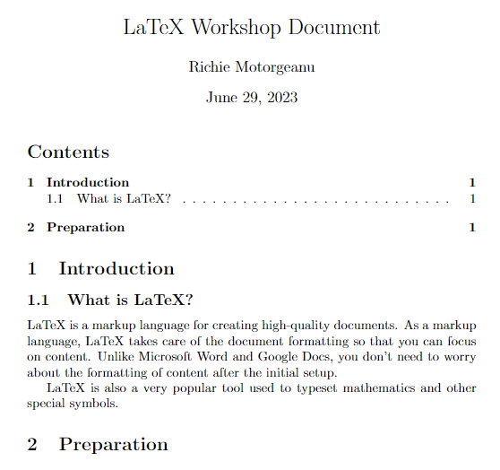

</details>

### Excluding Sections from the Table of Contents

- To exclude a section from appearing in the table of contents, simply add an asterix * in the command before the parameters. This will also prevent the section from being numbered.
  - `\section*{Section Name}`

<details markdown="1">
<summary>Creating a Table of Contents Example</summary>

{: .label }
Input
```latex
% extra lines of code not shown

\begin{document}

\maketitle

\tableofcontents

\section{Introduction}
\subsection{What is LaTeX?}

LaTeX is a markup language for creating high-quality documents. As a markup language, LaTeX takes care of the document formatting so that you can focus on content. Unlike Microsoft Word and Google Docs, you don’t need to worry about the formatting of content after the initial setup. 

LaTeX is also a very popular tool used to typeset mathematics and other special symbols.

% Adding the asterix will remove the section from the table of contents
\subsection*{Example Figures}

\section{Preparation}

\end{document}
```

{: .label .label-green }
Output
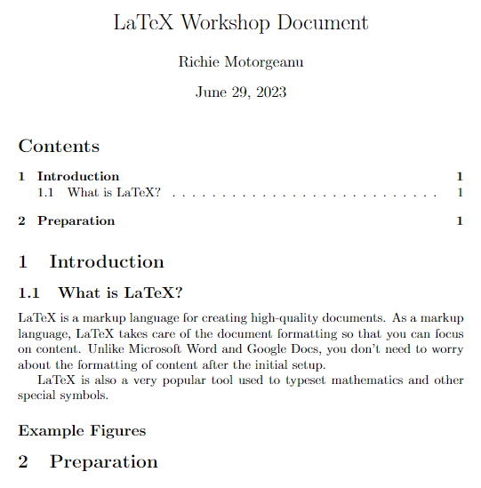

</details>

### Using Text Emphasis 

- To make text bold, use the `\textbf{}` and include the text as the parameter.
- To make text italic, use the `\textit{}` and include the text as the parameter.
- To underline text, use the `\underline{}` and include the text as the parameter.

<details markdown="1">
<summary>Using Text Emphasis Example</summary>

{: .label }
Input
```latex
% extra lines of code not shown

\begin{document}

\maketitle

\tableofcontents

\section{Introduction}
\subsection{What is LaTeX?}

LaTeX is a markup language for creating high-quality documents. As a markup language, LaTeX takes care of the document formatting so that you can focus on content. Unlike Microsoft Word and Google Docs, you don’t need to worry about the formatting of content after the initial setup. 

LaTeX is also a very popular tool used to typeset mathematics and other special symbols.

% Adding the asterix will remove the section from the table of contents
\subsection*{Example Figures}
\textbf{This is bolded text.}

\textit{This is italic text.}

\underline{This is underlined text.}

\section{Preparation}

\end{document}
```

{: .label .label-green }
Output
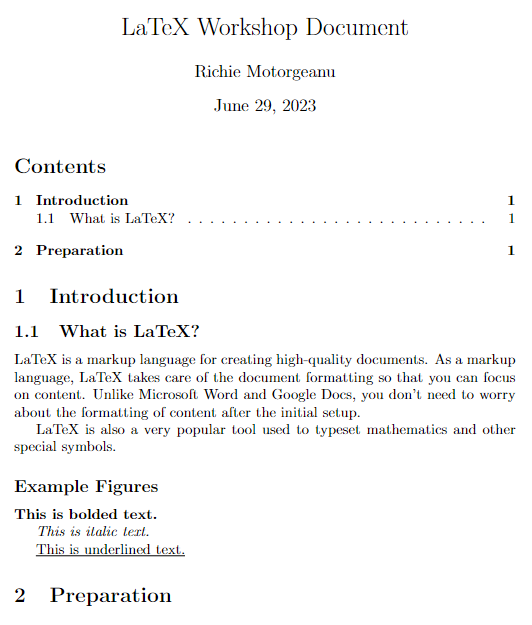

</details>

- Try combinining text emphasis out! Make bold italic text, or maybe italic underlined text!

<details markdown="1">
<summary>Combining Text Emphasis Example</summary>

{: .label }
Input
```latex
% extra lines of code not shown

\begin{document}

\maketitle

\tableofcontents

\section{Introduction}
\subsection{What is LaTeX?}

LaTeX is a markup language for creating high-quality documents. As a markup language, LaTeX takes care of the document formatting so that you can focus on content. Unlike Microsoft Word and Google Docs, you don’t need to worry about the formatting of content after the initial setup. 

LaTeX is also a very popular tool used to typeset mathematics and other special symbols.

% Adding the asterix will remove the section from the table of contents
\subsection*{Example Figures}
\textbf{This is bolded text.}

\textit{This is italic text.}

\underline{This is underlined text.}

\textbf{\textit{This is bold italic text.}}

\textit{\underline{This is italic underlined text.}}

\section{Preparation}

\end{document}
```

{: .label .label-green }
Output
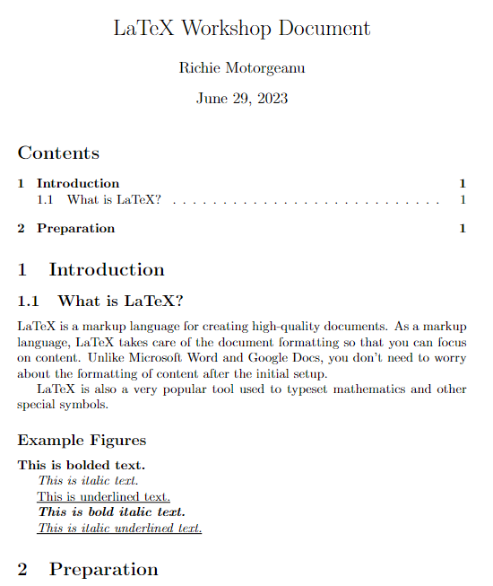

</details>

### Creating Inline Math

- To create inline math statements, surround the math equation with dollar signs $ $. 
- Any text inside the dollar signs will be in "math mode", and LaTeX will format it as if it were a math equation. 
  - The example below showcases how "x = 1" looks like with and without math mode.

<details markdown="1">
<summary>Math Mode Example</summary>

{: .label }
Input
```latex
% extra lines of code not shown
\section{Preparation}

% Without math mode:
Suppose x = 1.

% With math mode:
Suppose $x = 1$.

\end{document}
```

{: .label .label-green }
Output
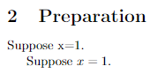

</details>

- In math mode, there are some extra commands supported that allow you to insert special characters. 
  - For a full list of predefined LaTeX mathematical symbols, see <https://oeis.org/wiki/List_of_LaTeX_mathematical_symbols>.

<details markdown="1">
<summary>Math Mode Symbols Example</summary>

{: .label }
Input
```latex
% extra lines of code not shown
\section{Preparation}

Suppose $x = 1$ and $y = 4$. Then $x \times y = 4$ and $x \div y = 0.25$.

\end{document}
```

{: .label .label-green }
Output


</details>

### Using $ and % in LaTeX

- Since the $ and % symbols are used for comments and math mode, LaTeX gets confused when you try to use them like normal. In order to insert a $ symbol or a % symbol, preceed the symbol with a backslash \\.

<details markdown="1">
<summary>Using a $ and % Example</summary>

{: .label }
Input
```latex
% extra lines of code not shown
\section{Preparation}

Suppose $x = 1$ and $y = 4$. Then $x \times y = 4$ and $x \div y = 0.25$.

We did a campaign where 50\% of all profits went to charity, and we raised over \$100,000.

\end{document}
```

{: .label .label-green }
Output
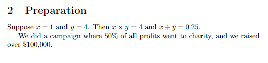

</details>

## Key Points / Summary

- The preamble tells LaTeX how to format the document, where as the body is the content of the document.
- You can create sections and paragraphs with automatically generated table of contents.
- You can also format math using math mode.
