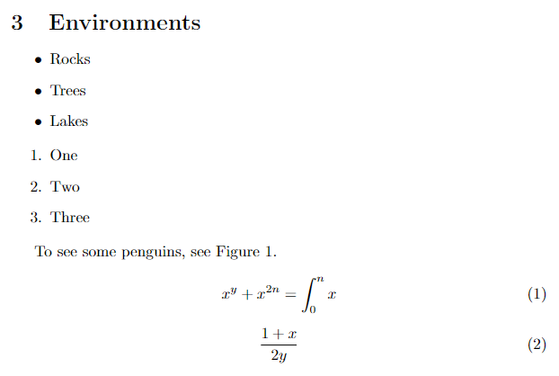

{: .no_toc}
# Lesson 2 - LaTeX Environments

In this lesson, we will take a look at some of the environments LaTeX has to offer, including bulleted and numbered lists, figures, and equations.

<details markdown="block">
  <summary>
    Table of Contents
  </summary>
  {: .text-delta }
- TOC
{:toc}
</details>

## Lesson Objectives
- Use environments to create special content
- Create lists, figures, and equations 

<!-- ## Lesson Video

The following video demonstrates each of the steps outlined below in text.
<iframe height="416" width="100%" allowfullscreen frameborder=0 src="https://echo360.ca/media/a347ed63-745d-4d08-8b9a-98b2dd0d0e14/public?autoplay=false&automute=false"></iframe>
[View original here.](https://echo360.ca/media/a347ed63-745d-4d08-8b9a-98b2dd0d0e14/public) -->

## What's an Environment?

An environment is a special section of your LaTeX document that's formatted differently than the rest of your document. In the previous lesson, we went over inline math expressions, which are also considered environments.

Usually, environments begin with `\begin{environment name}` and end with `\end{environment name}`. 

LaTeX offers many environments, but here we will cover lists, figures, and equations.

## Lists

We have two different types of lists to cover, bulleted lists and numbered lists.

### Bulleted Lists

- To create a bulleted list, we must create an `itemize` environment. This means we must start with `\begin{itemize}` and end with `\end{itemize}`.
- Inside our environment, each item in our list will start with `\item` followed by the item itself. Take a look at the example below.

<details markdown="1">
<summary>Bulleted List Example</summary>

{: .label }
Input
```latex
% extra lines of code not shown to save space

\section {Environments}

\begin{itemize}
  \item Rocks
  \item Trees
  \item Lakes
\end{itemize}

\end{document}
```

{: .label .label-green }
Output


</details>

### Numbered Lists

- To create a numbered list, we must create an `enumerate` environment.
- Just like in the itemize environment, each item of our list will start with `\item` followed by the item itself.

<details markdown="1">
<summary>Numbered List Example</summary>

{: .label }
Input
```latex
% extra lines of code not shown to save space

\section {Environments}

\begin{itemize}
  \item Rocks
  \item Trees
  \item Lakes
\end{itemize}

\begin{enumerate}
  \item One
  \item Two
  \item Three
\end{enumerate}

\end{document}
```

{: .label .label-green }
Output


</details>

## Figure Environment

In order to add images to our LaTeX document, we need to first upload the image into Overleaf. 

### Uploading Your Images

- Navigate to the file explorer at the top left of the Overleaf window and select the `Upload` button.


- Then upload an image in the `Upload` section of the `Add Files` popup.


- Your image should now appear in the file explorer.

### Using the Figure Environment

To insert an image, we use the figure environment.

- Start a new figure environment. If you're on Overleaf, it will fill out a couple more lines for you.

```latex
\begin{figure}
    \centering
    \includegraphics{}
    \caption{Caption}
    \label{fig:enter-label}
\end{figure}
```

- In order:
  - `\centering` centers our image.
  - `\includegraphics{fileName}` specifies what file we should use for our image.
  - `\caption{Caption}` sets up a caption for our figure.
  - `\label{fig:enter-label}` creates a label for our figure. This doesn't create anything visible on the document, but it'll allow us to reference the figure in our text later on. We'll cover this soon.
- In your LaTeX document, fill in the `\includegraphics`, `\caption`, and `\label` lines.

<details markdown="1">
<summary>Creating an Image Example</summary>

{: .label }
Input
```latex
% extra lines of code not shown to save space

\begin{figure}
    \centering
    \includegraphics{penguin-photo.jpg}
    \caption{Just some penguins}
    \label{fig:penguin}
\end{figure}

\end{document}
```

{: .label .label-green }
Output


</details>

- Depending on your image, you may get a warning. LaTeX will still attempt to create the figure, but the warning signifies that something is probably wrong. In this case, our image is too big!
- To change the width of the image, we can use an optional parameter on the `\includegraphics` line.
  - ```latex
    \includegraphics[width=12cm]{penguin-photo.jpg}
    ```

<details markdown="1">
<summary>Resizing an Image Example</summary>

{: .label }
Input
```latex
% extra lines of code not shown to save space

\begin{figure}
    \centering
    \includegraphics[12cm]{penguin-photo.jpg}
    \caption{Just some penguins}
    \label{fig:penguin}
\end{figure}

\end{document}
```

{: .label .label-green }
Output


</details>

Now our image fits on our document! You may notice, however, that the image isn't where we placed it in our text. It should appear at the end of our document, but it appears at the top, above our lists. What's going on?

This is one of LaTeX's *quirks*. In the figure environment, LaTeX makes the decision of where the image will appear - sometimes it's at the top of a page, sometimes it's at the bottom. There are workarounds to get images where you want them, for example, using the `\includegraphics` command outside of a figure environment. If you're just looking to place an image on a page and reference it in your text,  the figure environment is perfect for that.

### Referencing Figures

You might have also noticed that LaTeX automatically assigns our image a figure number. If you create more figures, LaTeX will automatically assign each figure a number based on their order of appearance. If we want to reference a specific image by label, we can use the `\ref` command with the figure's label. LaTeX will find that image's figure number and insert it in the text.

- See the example below.

<details markdown="1">
<summary>Referencing Figures Example</summary>

{: .label }
Input
```latex
% extra lines of code not shown to save space

\begin{figure}
    \centering
    \includegraphics[12cm]{penguin-photo.jpg}
    \caption{Just some penguins}
    \label{fig:penguin}
\end{figure}

To see some penguins, see Figure \ref{fig:penguin}.

\end{document}
```

{: .label .label-green }
Output


</details>

## Equation Environment

To create equations, we first need to use the `amsmath` package. The `amsmath` package adds some additional commands and support for math in LaTeX. Overleaf does not need you to explicitly import the package, but it's still good to do so.

- Add `\usepackage{amsmath}` at the top of your document.

### Creating an Equation

Now that we have the `amsmath`, we can create our first equation.

- Create an `equation` environment using the `\begin{}` format rather than `$`.

<details markdown="1">
<summary>Creating an Equation Environment Example</summary>

{: .label }
Input
```latex
% extra lines of code not shown to save space

% ^ makes the next character an exponent. If you need multiple characters, surround it with curly brackets { }
% _ similarly creates a subscript.
% \int creates the integral symbol 

\begin{equation}
  x^y + x^{2n} = \int_0^n x
\end{equation}

\end{document}
```

{: .label .label-green }
Output


</details>

There are **a lot** of math symbols, and we can't possibly cover them all. However, this is a nice cheat sheet with most of the mathematical symbols supported.

{: .note-title}
> Tip
>
> When using LaTeX, you'll often find yourself Googling "How do I do \_\_\_\_" or "How do I use a \_\_\_\_ symbol". There are lots of resources available online that will help you do just about anything in LaTeX.

- Make one more equation using the equation environment.

<details markdown="1">
<summary>Another Equation Environment Example</summary>

{: .label }
Input
```latex
% extra lines of code not shown to save space

% ^ makes the next character an exponent. If you need multiple characters, surround it with curly brackets { }
% _ similarly creates a subscript.
% \int creates the integral symbol 

\begin{equation}
  x^y + x^{2n} = \int_0^n x
\end{equation}

\begin{equation}
  \frac{1+x}{2y}
\end{equation}

\end{document}
```

{: .label .label-green }
Output


</details>

### Non-Numbered Equation Environments

As you can see, it automatically numbers your equations. If you do not want your equation to be numbered, use the `equation*` environment.

<details markdown="1">
<summary>Non Numbered Equation Environment Example</summary>

{: .label }
Input
```latex
% extra lines of code not shown to save space

% ^ makes the next character an exponent. If you need multiple characters, surround it with curly brackets { }
% _ similarly creates a subscript.
% \int creates the integral symbol 

\begin{equation}
  x^y + x^{2n} = \int_0^n x
\end{equation}

\begin{equation*}
  \frac{1+x}{2y}
\end{equation*}

\end{document}
```

{: .label .label-green }
Output


</details>

## Other Stuff!

That just about wraps up the LaTeX workshop. Keep in mind that, while you've just finished this workshop, there are lots more things to learn and explore with LaTeX. Some of these things include:

- Bibliography management - BibTeX, BibLaTeX, natlib
- More environments - Tables, matrices, etc.
- New commands
- Multi-part documents
- Other document classes - posters and presentations
- and more!

## Key Points / Summary

- Environments are portions of a document that are formatted differently
- You can create lists, figures, and equations using environments
